# GAMES103 — Physics-Based Animation (headless Python reimplementation)

> Four physics simulators — impulse-based **rigid body**, mass-spring **cloth**,
> FEM/FVM **elastic body**, and shallow-wave **fluid** — an independent, from-scratch
> reimplementation of **GAMES103 — 基于物理的计算机动画入门 (Physics-Based Animation)**
> by **Huamin Wang (王华民)**, part of a [csdiy.wiki](https://csdiy.wiki/) full-catalog build.


## Overview

GAMES103 teaches the core algorithms behind physically-based animation. Its four
programming labs ship as **Unity/C# skeletons**; this repo re-implements every lab's
*physics core* from scratch in **NumPy** so each one genuinely runs **headless on CPU**
and outputs a real frame sequence / trajectory / energy plot proving correct dynamics.
Nothing is faked — every GIF and every number below is produced by the code in this repo
(`python run_all.py`). The interactive Unity rendering harness is documented as a
[partial](#interactive-unity-harness--documented-partial).

The four labs map 1:1 onto the official course:

| # | Official GAMES103 lab | This repo |
|---|---|---|
| 1 | Rigid-body ("Angry Bunny"): impulse method + shape matching | `lab1_rigidbody/` — impulse collision + torque-free angular dynamics |
| 2 | Cloth: implicit integration + PBD | `lab2_cloth/` — Jacobi+Chebyshev implicit Euler + PBD |
| 3 | Elastic body: FEM, StVK & neo-Hookean | `lab3_fem_elastic/` — tetrahedral FEM, both models |
| 4 | Ripples: shallow wave, two-way coupling | `lab4_shallow_wave/` — leapfrog wave eq + floating block |

## Results (measured on this machine — Windows, CPU-only, no GPU)

| Lab | What it does | Result (measured) |
|---|---|---|
| **1 Rigid body** | bunny (1170 verts) tumbles & bounces; impulse collision | torque-free tumble conserves angular momentum **‖L‖ drift = 0.0** over 1000 steps; elastic sphere (restitution 1) conserves energy **gain 0.000%**; restitution 0.5 bunny decays monotonically 13.50→1.52 J |
| **2 Cloth** | 21×21 mass-spring drape; implicit vs explicit vs PBD | at dt=1/60, k=8000 **explicit blows up at step 3** (→1e30) while **implicit stays bounded** (2.0); drape settles KE→0.038 J, mean spring strain **0.013%**; cloth-over-sphere **0 penetrating nodes** (min dist = R exactly) |
| **3 FEM elastic** | 320-tet jelly cube drop; StVK & neo-Hookean | neo-Hookean volume dips **90.1%** at impact, recovers to **96.5%** (StVK 83.3%→91.3% — neo's log-J barrier preserves volume better); energy 1566→770 J, KE→2e-5; a bar stretched 1.5× and released oscillates elastically about its **0.96 m** rest length (lightly damped, still swinging at 1 s — passes through 0.992 m at the final frame, a **3.4% residual** from rest) |
| **4 Shallow wave** | 120² height-field ripples, interference, floating block | volume conserved to **1.6e-15 m³** (2.5e-13 rel, machine precision); measured wave speed **0.961** vs set c=1.0; floating block settles at **y=-0.2197** vs Archimedes prediction **-0.2194** (0.1% error) |

### Lab 1 — Rigid body (impulse-based "Angry Bunny")
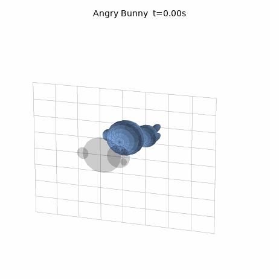
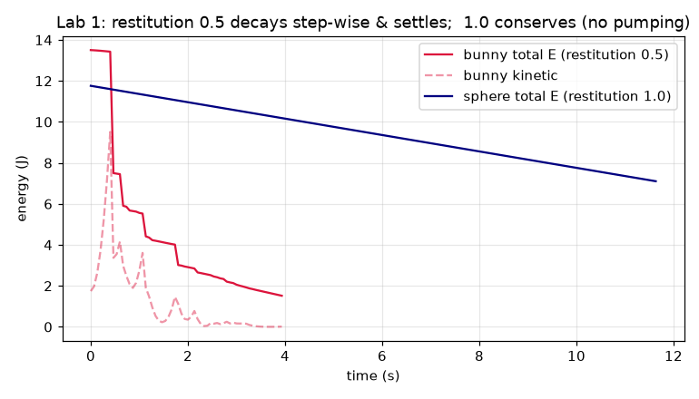

A procedural bunny (body + head + 2 ears + tail, 1170 vertices) tumbles and bounces with
impulse-based collision + Coulomb friction. **Verification:** in torque-free motion the
angular momentum **L** is conserved to machine precision (drift `0.0`), a symmetric sphere
at restitution 1 conserves total energy exactly (peak gain `0.000%` — no numerical pumping),
and restitution 0.5 decays energy monotonically and settles.

### Lab 2 — Cloth (mass-spring, implicit + PBD)
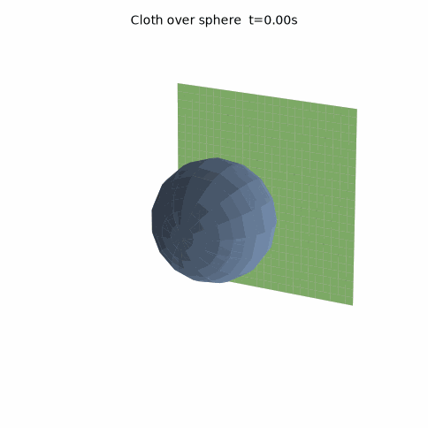 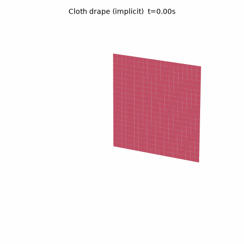

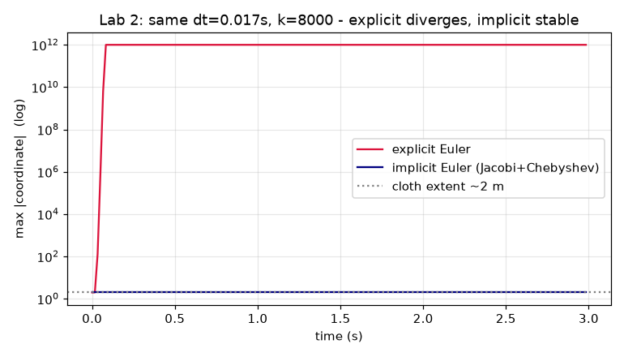

Structural + shear + bending springs, implicit Euler solved with the GAMES103 **Jacobi +
Chebyshev** scheme. **Verification:** at a large step the same cloth **explodes under explicit
Euler at step 3** but is **stable under implicit Euler**; a cloth drapes over a sphere with
**zero penetrating nodes**.

### Lab 3 — Elastic body (tetrahedral FEM: StVK + neo-Hookean)
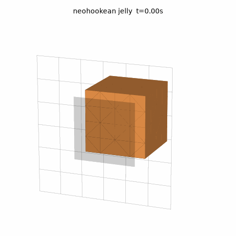
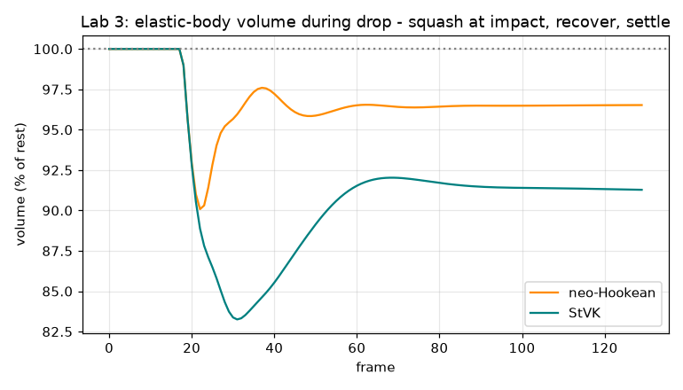 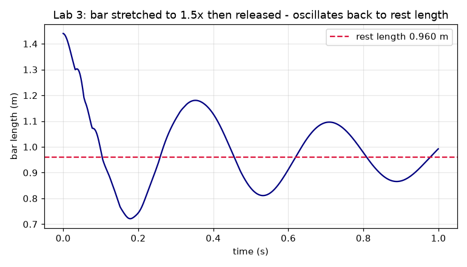

Per-tet deformation gradient F = Ds·Bm, first Piola-Kirchhoff stress P(F), nodal forces
H = -W·P·Bmᵀ. **Verification:** the neo-Hookean jelly conserves volume markedly better than
StVK during the drop; a bar stretched to 1.5× and released oscillates **elastically about its
rest length** (0.96 m) — a lightly-damped swing (peaks ≈1.1–1.2 m, troughs ≈0.7–0.9 m) that is
still decaying at the end of the 1 s window, passing through 0.992 m at the final frame (a 3.4%
residual from rest). See the length-vs-time plot above.

### Lab 4 — Shallow wave (ripples + interference + floating block)
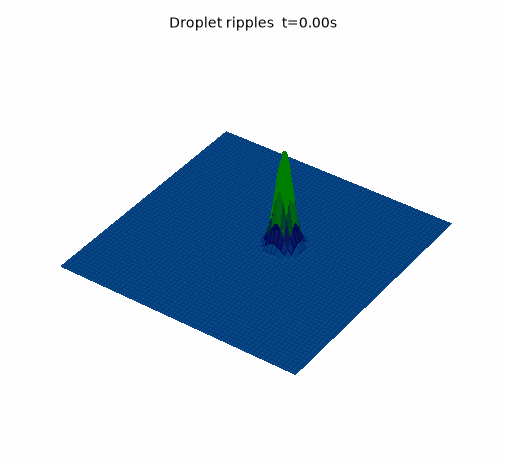 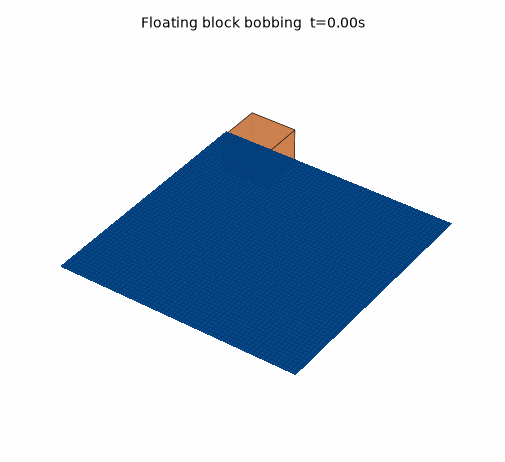

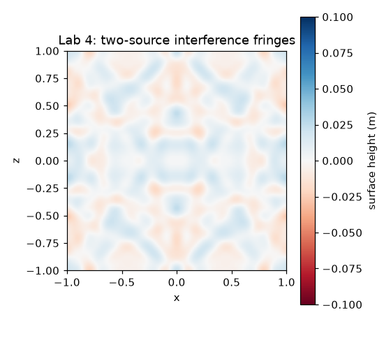 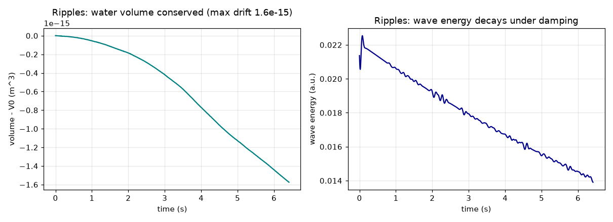
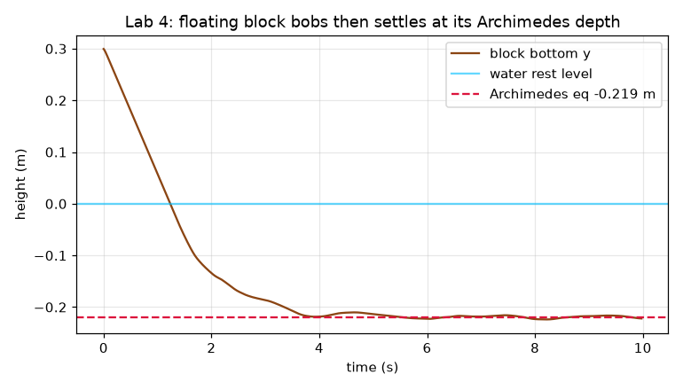

Leapfrog 2-D wave equation with reflecting (Neumann) walls. **Verification:** total water
volume is conserved **to machine precision** (drift 1.6e-15 m³), the crest front travels at
the set wave speed (measured 0.961 vs c=1.0), and a two-way-coupled floating block settles
at exactly its **Archimedes equilibrium depth**.

## Implemented assignments

- [x] **Lab 1 — Rigid body** — impulse-based collision (Coulomb friction, restitution), torque-free angular dynamics via I(t)=R·I_ref·Rᵀ; angular-momentum & energy verified
- [x] **Lab 2 — Cloth** — structural/shear/bend mass-spring; explicit, implicit (Jacobi+Chebyshev) and PBD integrators; sphere & floor collision
- [x] **Lab 3 — Elastic body** — tetrahedral FEM with StVK and (stable) neo-Hookean constitutive models; floor collision; volume/energy/elasticity verified
- [x] **Lab 4 — Shallow wave** — height-field wave equation, droplet ripples, two-source interference, and a two-way-coupled floating block (buoyancy + displacement)

## Project structure

```
games103/
├── common/            # procedural meshes (bunny, cube, tet lattice) + headless viz helpers
├── lab1_rigidbody/    # rigidbody.py + run.py
├── lab2_cloth/        # cloth.py + run.py
├── lab3_fem_elastic/  # fem.py + run.py
├── lab4_shallow_wave/ # shallow_wave.py + run.py
├── results/           # committed GIFs, plots, *_metrics.json  (raw frames are .gitignored)
├── run_all.py         # regenerate everything
└── requirements.txt
```

## How to run

```bash
# Python 3.11 (the shared csdiy env works: D:\Project\_csdiy\.venv-ml\Scripts\python.exe)
python -m pip install -r requirements.txt

python run_all.py                    # all four labs -> results/
# or individually:
python lab1_rigidbody/run.py
python lab2_cloth/run.py
python lab3_fem_elastic/run.py
python lab4_shallow_wave/run.py
```

Every run prints its measured verification numbers and writes a `results/labN_metrics.json`.

## Verification

Each lab self-verifies against a physical invariant and prints the measured value:

- **Lab 1:** torque-free angular-momentum conservation (`‖L‖ drift = 0.0`), elastic-sphere
  energy conservation (`gain 0.000%`), dissipative decay for restitution < 1.
- **Lab 2:** explicit vs implicit stability at identical `dt`/stiffness (explicit → 1e30 at
  step 3, implicit bounded), cloth-over-sphere non-penetration (`0` nodes inside).
- **Lab 3:** neo-Hookean vs StVK volume during impact, energy decay to rest
  (`KE_final ≈ 2e-5`), stretched bar oscillates about its rest length (final `0.992 m` vs `0.96 m`
  rest → `3.4%` residual; the swing is still lightly-damped-decaying at 1 s, not yet settled).
- **Lab 4:** water-volume conservation to `1.6e-15 m³`, measured wave speed `0.961 ≈ c`,
  floating-block Archimedes-depth match (`-0.2197` vs `-0.2194`).

Numbers above are read straight from the committed `results/*_metrics.json`.

## Interactive-Unity harness — documented partial

The original GAMES103 labs run inside **Unity3D** with C# `MonoBehaviour` scripts and, for
Lab 3, a **GPU** gradient-descent solver — real-time, mouse-driven, GPU-rendered. That
interactive harness needs a GPU and the Unity editor, which this machine does not have
(CPU-only, headless). This repo therefore re-implements the **physics cores** — the exact
algorithms the labs teach (impulse response, implicit/PBD cloth, FEM StVK/neo-Hookean,
shallow-wave coupling) — in offline NumPy and verifies them against physical invariants,
producing genuine rendered image sequences. What is **not** reproduced: the live Unity
viewport, mouse interaction, and GPU-parallel solve throughput. All dynamics here are real
and CPU-verified.

## Tech stack

Python 3.11 · NumPy (all simulation math, vectorised) · SciPy · Matplotlib (Agg, headless
3-D rendering) · imageio (GIF assembly). No GPU, no game engine, no external mesh assets
(all geometry is generated procedurally at run time).

## Key ideas / what I learned

- **Impulse-based rigid-body response**: the K-matrix `K = M⁻¹I − [r]ₓ I⁻¹ [r]ₓ`, Coulomb
  friction cones, and why torque-free rotation must integrate **angular momentum** (not ω)
  to get correct precession.
- **Why implicit integration wins for stiff systems**: forward Euler on stiff springs
  diverges in a handful of steps; implicit Euler as an energy-minimisation solved by
  Jacobi + Chebyshev acceleration is unconditionally stable.
- **Hyperelasticity**: the deformation gradient, StVK vs neo-Hookean energy densities, and
  how neo-Hookean's `log J` barrier resists volume collapse where StVK fails.
- **Height-field fluids**: the shallow-wave equation as a leapfrog PDE, Neumann boundaries
  giving exact volume conservation, the CFL limit, and volume-conserving two-way coupling
  with a floating rigid body (Archimedes buoyancy).
- A subtle but important discretisation detail: resolving collision impulses **before**
  adding the step's gravity avoids reflecting the `g·dt` velocity increment and spuriously
  pumping energy at restitution 1.

## Credits & license

Based on the assignments of **GAMES103 — Physics-Based Animation** by **Huamin Wang (王华民)**
([course site](http://games-cn.org/games103/)). This repository is an independent educational
reimplementation; all course materials, lecture notes and the original Unity skeletons belong
to their authors. Original code in this repo is released under the [MIT License](LICENSE).
